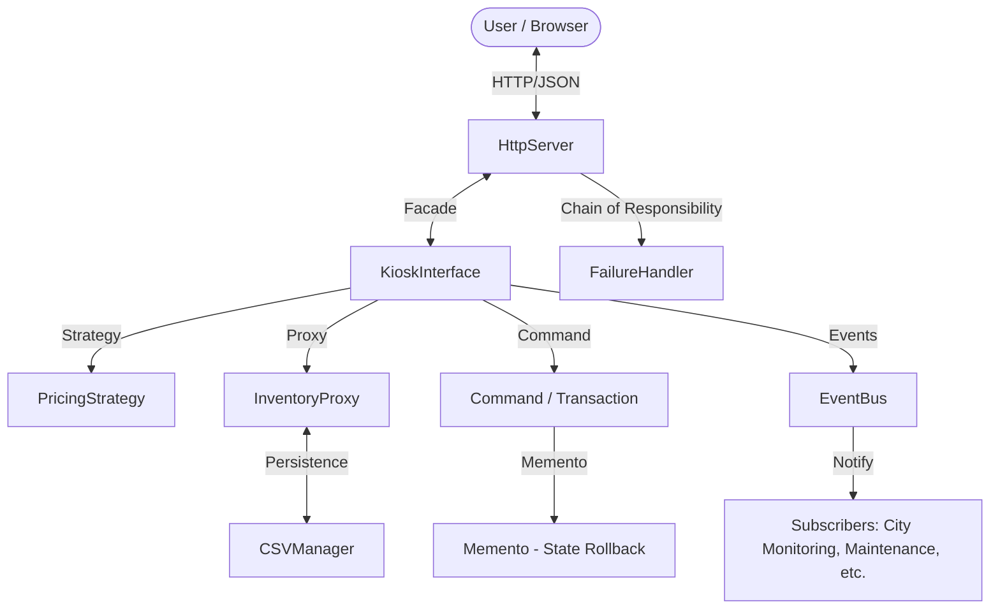

# Aura Retail OS 🛡️
> **Adaptive Autonomous Modular Smart-City Retail Infrastructure**

Aura Retail OS is a modular, adaptive software platform designed for the smart city of Zephyrus. It powers autonomous retail kiosks (Aura Kiosks) across diverse environments—from hospitals and metro stations to disaster zones. 

This project was developed for the **IT620: Object-Oriented Programming** course, specifically focusing on **Path A: Adaptive Autonomous System**, emphasizing intelligent behavior, dynamic decision-making, and robust failure recovery.

---

## 👥 Contributors (Team 17 - 404 Error Not Found)
| Name | Student ID |
| :--- | :--- |
| **Parin Makwana (Leader)** | 202512098 |
| **Ayush Soni** | 202512030 |
| **Shruti Makwana** | 202512001 |
| **Krisha Shah** | 202512064 |

---

## 🎯 Design Patterns & Requirement Satisfaction
The system implements **10 Design Patterns** to satisfy the rigorous requirements of an autonomous city infrastructure.

### 1. Dynamic Pricing & Operational Flexibility
*   **Requirement**: Switch pricing strategies and operational modes at runtime.
*   **Pattern: Strategy & State**
    *   **Strategy**: Used for `PricingStrategy`. It allows the kiosk to swap between *Standard*, *Discount*, and *Emergency* pricing on the fly without altering product data.
    *   **State**: Manages `KioskState` (Active, Power-Saving, Maintenance, Emergency). Each state modifies how the kiosk interacts with users (e.g., restricting sales during lockdown).

### 2. Autonomous Failure Handling
*   **Requirement**: Handle hardware or transaction failures through a sequence of recovery steps.
*   **Pattern: Chain of Responsibility**
    *   **Implementation**: Errors are passed through a chain: `AutoRetryHandler` ➡️ `RecalibrationHandler` ➡️ `TechnicianAlertHandler`. This ensures the system attempts self-healing before escalating to human intervention.

### 3. Atomic Transactions & State Rollback
*   **Requirement**: Transactions must be atomic. If a hardware error occurs during dispensing, the system must restore its previous state.
*   **Pattern: Command & Memento**
    *   **Command**: Every purchase is a `PurchaseItemCommand`, encapsulating the logic for execution and logging.
    *   **Memento**: Before any transaction, an `InventoryMemento` is captured. If the hardware fails to dispense, the system uses the memento to roll back inventory levels, ensuring data consistency.

### 4. Event-Driven Communication
*   **Requirement**: Subsystems must communicate through events (LowStock, HWFailure) to maintain low coupling.
*   **Pattern: Observer**
    *   **Implementation**: A centralized `EventBus` allows subsystems to publish events. Subscribers (like the City Monitoring Center) react to these events without being directly tied to the hardware modules.

### 5. Secure & Controlled Access
*   **Requirement**: Centralized global configuration and secure inventory access.
*   **Pattern: Singleton & Proxy**
    *   **Singleton**: `CentralRegistry` and `CSVManager` ensure a single source of truth for configuration and data persistence.
    *   **Proxy**: `SecureInventoryProxy` acts as a gatekeeper to the inventory, ensuring that all stock checks and updates are authorized and logged.

### 6. Modular Creation & Simplified Interface
*   **Requirement**: Create compatible components for different kiosk types and provide a simplified interface for external systems.
*   **Pattern: Abstract Factory & Facade**
    *   **Abstract Factory**: `KioskFactory` produces compatible modules (Dispensers, Verifiers) tailored to specific kiosk types (Pharmacy, Food, Relief).
    *   **Facade**: `KioskInterface` provides a clean API (`purchaseItem()`, `runDiagnostics()`) for the UI, hiding the complex orchestration of commands and hardware underneath.

---

## 🚀 Getting Started (Run Guide)

### 1. Prerequisites
*   **OS**: Windows (Required for the `winsock2` networking library).
*   **Compiler**: `g++` (MinGW-w64) with C++17 support.
*   **Terminal**: PowerShell or CMD.

### 2. Compilation
Run the following command in the project root to compile the server:
```powershell
g++ -std=c++17 -Iinclude -I. src/main.cpp src/HttpServer.cpp src/KioskInterface.cpp src/CentralRegistry.cpp src/EventBus.cpp src/FailureHandler.cpp src/CSVManager.cpp src/InventoryProxy.cpp src/KioskState.cpp src/Command.cpp -o AuraRetailOS.exe -lws2_32
```
*The `-lws2_32` flag links the Windows Socket libraries required for the web dashboard.*

### 3. Execution
Start the Retail OS server:
```powershell
.\AuraRetailOS.exe
```
The server will start listening on port **8080**.

### 4. Open the Dashboard
Open your browser and go to:
👉 **[http://localhost:8080](http://localhost:8080)**

---

## 📂 Project Architecture
*   `src/` & `include/`: Core C++ implementation of the Design Patterns.
*   `data/`: CSV-based persistence layer for Inventory, Users, and Transactions.
*   **UI Layer**: A modern, responsive dashboard built with HTML/CSS/JS that communicates with the C++ backend via a RESTful HTTP server.

---

## 🏗️ System Architecture
The project follows a modular architecture where the **HTTP Server** acts as the bridge between the user and the core **Kiosk Logic**.



---

## 🔄 Core Workflows

### 1. Purchase Workflow (Atomicity & Persistence)
1.  **API Call**: User triggers a purchase from the dashboard (POST `/purchase`).
2.  **Strategy**: The system calculates the price using the current `PricingStrategy` (Standard/Discount/Emergency).
3.  **State Save**: A `Memento` of the inventory is captured before execution.
4.  **Command Execution**: A `PurchaseCommand` is executed to update stock.
5.  **Persistence**: `CSVManager` writes the new stock levels to disk.
6.  **Rollback**: If a hardware error is detected during the process, the `Memento` restores the inventory to its original state.

### 2. Failure Recovery Workflow
1.  **Trigger**: A hardware malfunction is simulated.
2.  **Chain of Responsibility**: The error passes through a sequence: `AutoRetry` ➡️ `Recalibrate` ➡️ `TechnicianAlert`.
3.  **Resolution**: If `AutoRetry` or `Recalibrate` succeeds, the system resumes operation automatically.

---

## 🕹️ Dashboard Mapping
Our Control Center UI is designed to prove that the "invisible" design patterns are functioning correctly.

| UI Component | Requirement Resolved | Underlying Pattern |
| :--- | :--- | :--- |
| **Workflow Visualizer** | Pattern Traceability | **Facade / Command** |
| **System Event Logs** | Decentralized Notification | **Observer** |
| **Real-time Inventory** | Secure Data Access | **Proxy** |
| **Mode Selectors** | Adaptive Pricing | **Strategy / State** |
| **Simulate HW Failure** | Autonomous Recovery | **Chain of Responsibility** |

---

## 🛠️ Troubleshooting
*   **Port 8080 in use**: Run `taskkill /F /IM AuraRetailOS.exe` to clear any hung processes.
*   **Data not loading**: Ensure the `data/` directory contains `inventory.csv` and `users.csv`.

---
*Developed for IT620 - Object Oriented Programming.*
